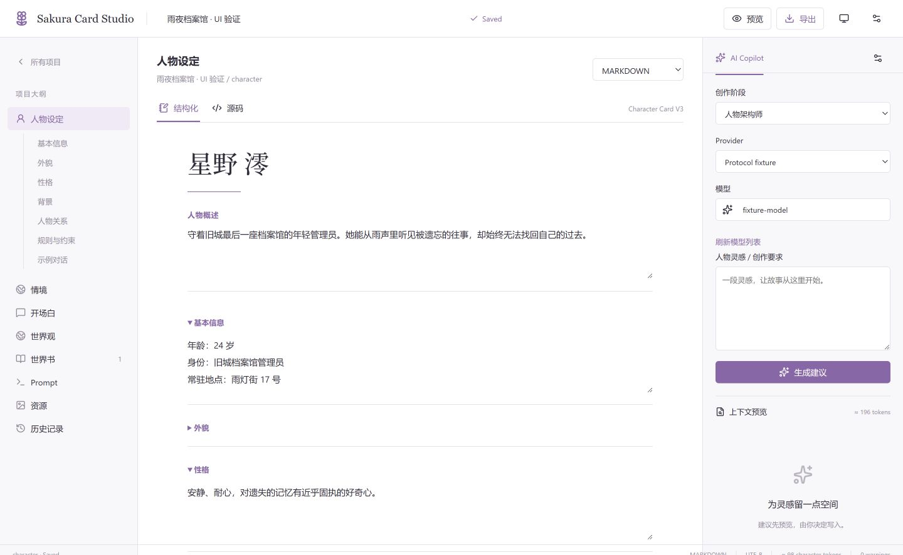
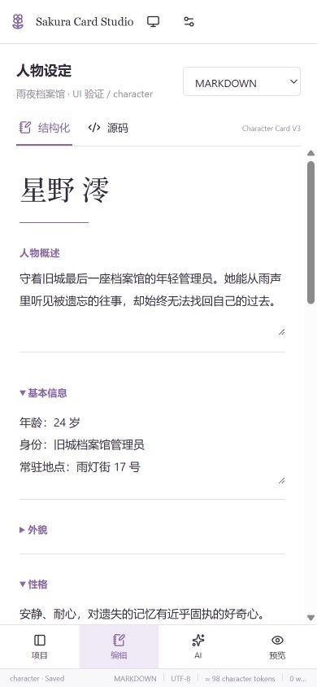

# Sakura Card Studio

面向 SillyTavern 角色卡作者的本地创作工作台。使用独立 Canonical Schema 保存人物、世界、世界书、开场白与 Prompt；结构化编辑器和 Monaco 源码编辑器共享同一份数据。AI 只生成可审阅建议，由作者决定是否写入。

## Screenshots




## 功能

- 项目创建、搜索、复制、重命名、归档；SQLite 自动保存、乐观锁与版本恢复。
- 人物设定、情境、主/备用开场白、世界观、世界书与 Prompt 编辑。
- Monaco 编辑 Markdown、YAML、JSON、XML wrapped Markdown，支持结构化视图切换。
- Character Card V2/V3 JSON 和 PNG 导入、V2/V3 JSON 与双版本 PNG 导出，保留未知扩展。
- 世界书关键词、次要关键词逻辑、概率、常驻/选择性激活、插入顺序与位置配置。
- OpenAI-compatible Provider、模型发现、默认模型、收藏、最近使用与模型图标。
- 八个 AI 创作角色；上下文预览、差异预览、编辑建议、逐项/批量采纳与拒绝；开场白先构思再成文。
- 图片资源保存与 vision 请求；浅色、深色、系统主题；桌面三栏与手机分区导航。

## Docker Quick Start

公开仓库：[yayitinyu/sakura-card-studio](https://github.com/yayitinyu/sakura-card-studio)。镜像工作流分别在 `ubuntu-24.04`（AMD64）与 `ubuntu-24.04-arm`（ARM64）原生构建，无 QEMU；两种架构均通过启动、PNG 导出、数据卷重建保留和非 root 检查后才合并 manifest。

推送 `main` 发布 `ghcr.io/yayitinyu/sakura-card-studio:latest`、`:main` 和 `:sha-<完整 commit SHA>`；推送 `v*` 标签发布同名镜像标签，亦可手动触发。使用内置 `GITHUB_TOKEN`，无需额外配置 Docker Hub 凭据。首次发布结果请查看 [Actions](https://github.com/yayitinyu/sakura-card-studio/actions/workflows/image.yml)。

镜像发布后可使用预构建版本：

```sh
docker run -d --name sakura-card-studio --restart unless-stopped -p 127.0.0.1:3000:3000 -v sakura-data:/app/data ghcr.io/yayitinyu/sakura-card-studio:latest
```

需要 Docker Engine 和 Compose v2。项目默认仅绑定本机端口，适合单用户部署。

```sh
cp .env.example .env
docker compose up -d --build
```

打开 <http://localhost:3000>。未填写 `APP_SECRET` 时，首次保存 Provider 会生成 `data/.app-secret`，后续重建沿用该文件。也可以在首次使用前自行设置至少 32 字符的随机 `APP_SECRET`，并妥善备份。

```sh
docker compose logs --tail=100 studio
docker compose stop studio
docker compose up -d --build
```

`./data` 挂载到 `/app/data`，镜像重建不应删除数据库。不要删除数据目录或密钥。容器入口仅为数据目录权限调整使用 root，应用通过 gosu 以 node 用户运行。

本次环境没有 Docker，因此 Dockerfile/Compose 已编写并静态检查，尚未执行镜像构建、容器重启或重建持久化验收。

## 环境变量与数据目录

| 变量 | 默认值 | 用途 |
| --- | --- | --- |
| `PORT` | `3000` | 本地服务端口 / Compose 主机端口 |
| `DATABASE_URL` | `file:./data/app.db` | SQLite 文件；容器固定为 `file:/app/data/app.db` |
| `APP_SECRET` | 自动生成并保存在数据库旁 | Provider 凭据加密主密钥，至少 32 字符 |
| `APP_HOST` | `127.0.0.1` | `npm start` 的监听地址 |

数据库包含项目、历史、资源图像、Provider 和 AI 建议。SQLite 使用 WAL，运行中还可能有 `app.db-wal`、`app.db-shm`。本地 `npm start` 会把数据库路径解析为项目根目录的绝对路径。

应用没有账号、权限管理或租户隔离。需要远程访问时，应在反向代理前加入身份验证和 HTTPS；不应直接公开匿名服务。Provider 允许连接本地 API，因此服务器网络访问权限也属于部署者的信任范围。

## API Provider 配置

打开设置，填写名称、Base URL（包括 `/v1` 等实际前缀）和 API Key，点击「获取模型」。选择默认模型并保存；可收藏常用模型。连接测试调用 `/models`，不代表某个模型一定能够生成有效内容。

后端调用 `/chat/completions`，支持 SSE 和可选 JSON mode。Vision、tools、JSON mode 能力由用户明确配置；tools 当前仅作为能力元数据保存，没有工具执行循环。Vision 使用项目已上传图片，模型必须支持 OpenAI 格式的 `image_url`。

API Key 使用 AES-256-GCM 加密保存在 SQLite。前端只收到掩码，卡片导出不包含 Provider。日志过滤 Authorization、常见密钥格式和已注册凭据。不要在人物文本中粘贴密钥，用户正文不属于凭据存储。

## Character Card compatibility

实现前核对了 [Character Card V2](https://github.com/malfoyslastname/character-card-spec-v2/blob/main/spec_v2.md)、[V3](https://github.com/kwaroran/character-card-spec-v3/blob/main/SPEC_V3.md)、[SillyTavern PNG parser](https://github.com/SillyTavern/SillyTavern/blob/release/src/character-card-parser.js) 和 [World Info implementation](https://github.com/SillyTavern/SillyTavern/blob/release/public/scripts/world-info.js)。参考快照位于 `docs/`。

- 内部模型与卡片格式分离，标准导出编译为 `description`、`personality`、`first_mes`、`mes_example`、`character_book` 等字段。
- PNG 写入 `tEXt` 中 base64 编码的 `chara`（V2）和 `ccv3`（V3）数据，读取优先 V3；校验 PNG CRC 与边界。
- 根层、data 层、lorebook/entry 的未知字段及 extensions 尽量保留。Studio 专属创作结构存入命名扩展，标准字段仍可供其他客户端使用。
- 导入时标准字段具有优先权；外部工具改过的 description 不会被旧 Studio 快照覆盖。
- 作者文本导出带可往返的元数据；移除元数据或经第三方重排后，不保证还原原有空白、注释、键顺序。XML 模式是 Character 包裹的作者文本，不是通用 XML 文档编辑器。
- `character_book` 与 SillyTavern World Info 的概率、深度、selectiveLogic 等扩展分别映射。Prompt 预览仅作组成与 token 估算，不实现完整 World Info 激活引擎。
- 未实现 CHARX 压缩包与资源打包；V3 外部资源引用可保留，应用 PNG 导出使用所选封面或默认封面。

详细结构见 [架构说明](docs/architecture.md)。

## 开发与测试

建议 Node.js 22 LTS，使用随项目提交的 lockfile。实际锁定版本以 `package-lock.json` 为准。

```sh
npm ci
npm run dev
npm run typecheck
npm test
npm run build
npm start
```

Monaco 资源在 predev/prebuild 阶段打包到 `public/editor`，不依赖 CDN。`npm start` 启动 standalone 产物并复制静态资源。

集成测试必须使用独立数据库。PowerShell 终端一：

```powershell
$env:PORT='3101'
$env:DATABASE_URL='file:./test-results/integration.db'
npm start
```

终端二运行 `npm run test:integration`。测试自行启动 3199 端口的确定性协议 fixture；不要同时运行 `tests/serve-fixture.ts`。测试会在独立数据库新增项目、Provider 和历史，不接触真实模型。测试 fixture 不用于生产业务。

已执行：16 项单元/回归测试、26 项生产 API 集成断言、生产构建。浏览器检查覆盖 1440×900、1920×1080、390×844：创建/保存、服务重启后读取、Provider/模型、AI 预览与编辑后采纳、两阶段开场白、世界书、Monaco、手机导航和 PNG 文件选择器导入。无相关控制台错误或页面横向溢出。

浏览器的下载事件等待超时，因此仅确认导出按钮触发且无页面错误；JSON/PNG 响应与重新导入的语义一致性由 API 集成测试验证，尚未确认浏览器下载文件的最终落盘位置。真实 Provider 输出质量、真实 SillyTavern 导入界面和 Docker 尚需目标环境验证。

## 备份与恢复

最简单的完整备份方式是短暂停止应用，再备份整个 `data` 目录（包含隐藏的 `.app-secret`）；如通过环境变量提供密钥，还需单独安全备份该值。不要只复制运行中的 `app.db` 而遗漏 WAL。

```sh
docker compose stop studio
tar -czf sakura-data-backup.tar.gz data
docker compose start studio
```

恢复时先停止应用，将现有数据目录改名保留，再把备份恢复到 `data`，使用原来的 APP_SECRET 后启动。密钥丢失后，原 Provider 凭据无法解密，需要重新输入；角色数据本身不依赖该密钥。

## 当前边界

单用户、单实例 SQLite 部署；没有多人实时协作、登录、关系图可视化或 CHARX。Token 数是启发式估算。AI 输出需符合受限 JSON Patch Schema，失败不写项目；暂不展示逐 token 草稿，也不自动运行工具。历史可恢复 Canonical 内容，资源与 Provider 不随项目 revision 回滚。
